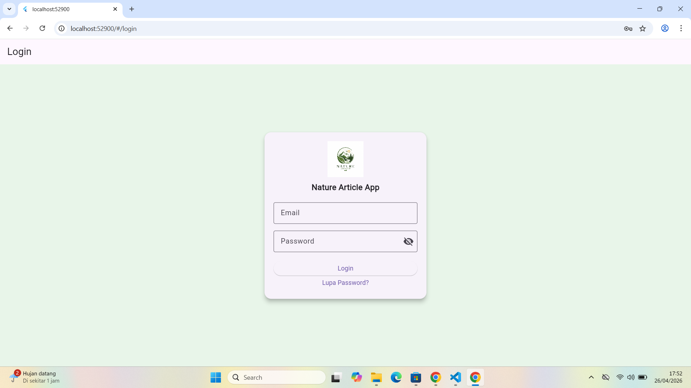
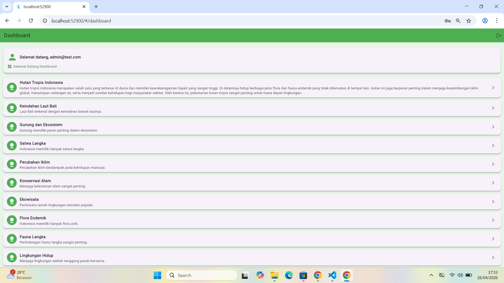
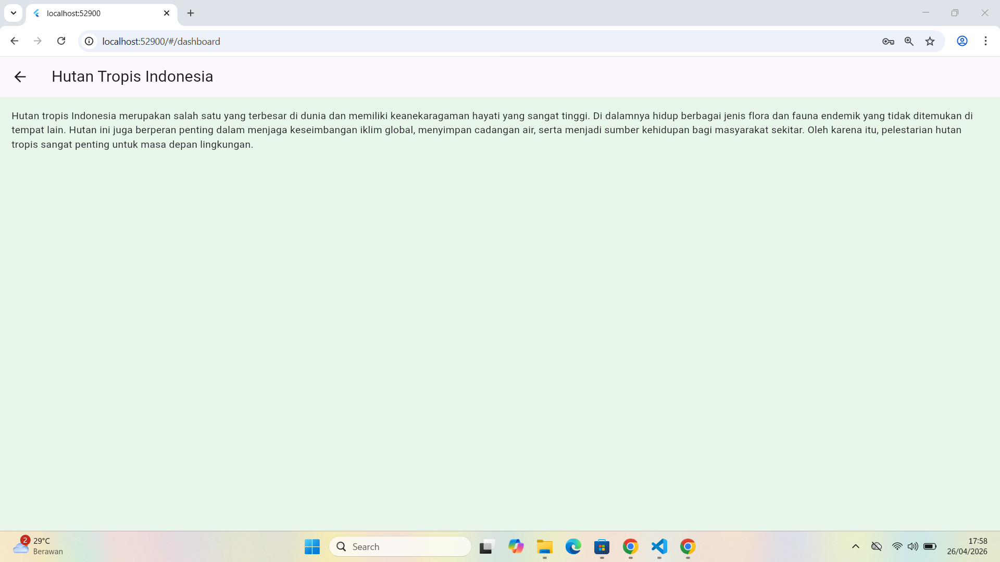
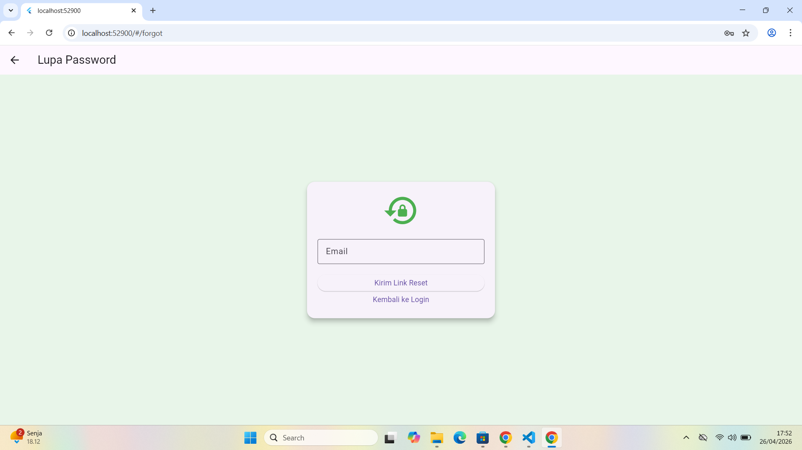

# Nature Article 

## 📌 Deskripsi
Aplikasi Flutter sederhana yang menampilkan artikel tentang alam seperti hutan, laut, dan lingkungan hidup.  
Aplikasi ini memiliki fitur login, forgot password, dan dashboard artikel.

---

## ✨ Fitur
- Login dengan validasi email & password
- Lupa password (simulasi kirim email)
- Dashboard menampilkan daftar artikel
- Halaman detail artikel
- Logout
- UI sederhana menggunakan Material Design

---

## ▶️ Cara Menjalankan
1. Clone repository ini
2. Buka di VS Code / Android Studio
3. Jalankan perintah:
   flutter pub get
4. Jalankan aplikasi:
   flutter run

---

## 📸 Screenshot

### Login Page

### Dashboard

### Detail Page

### Reset Password

---
